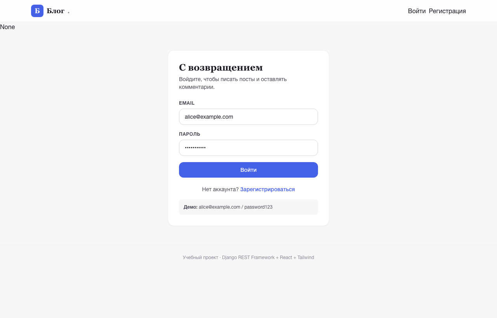
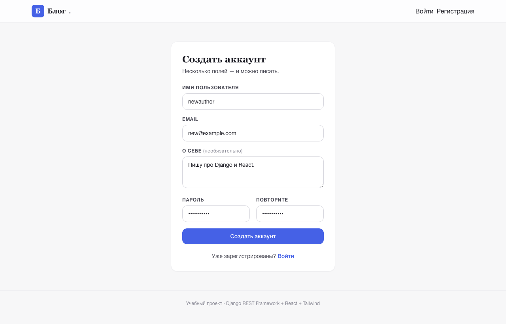
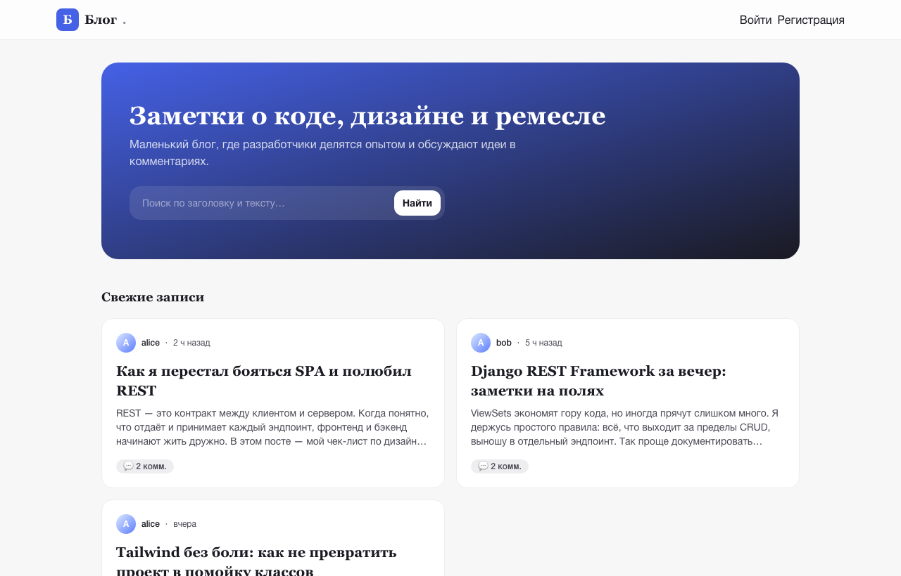
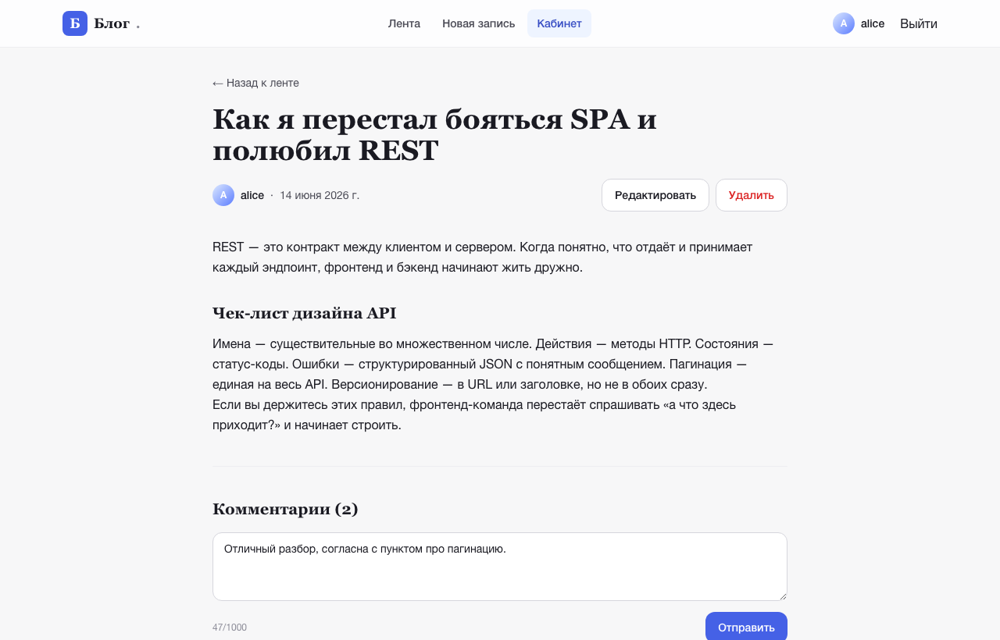
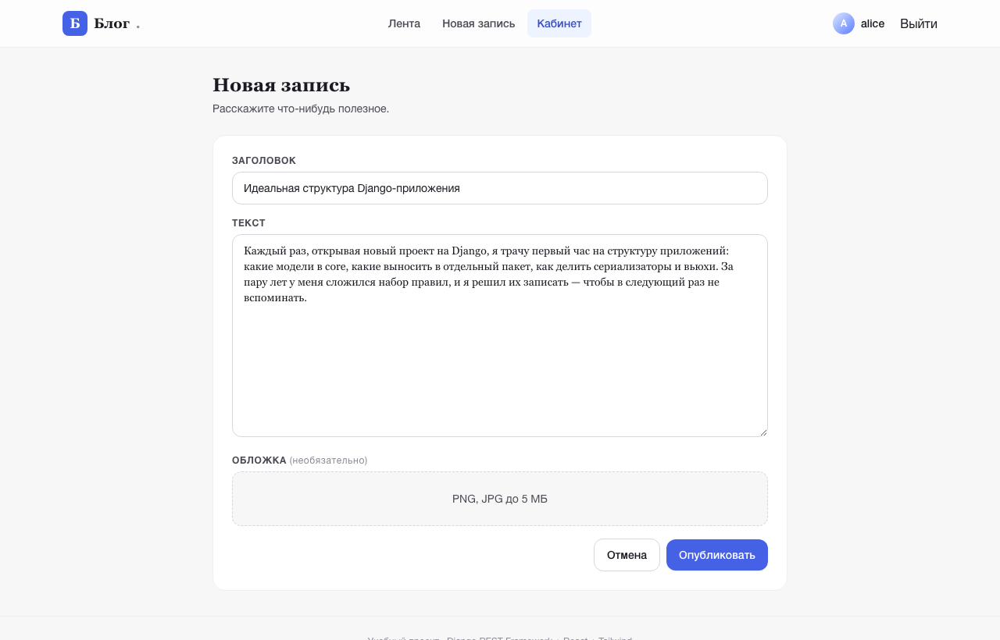
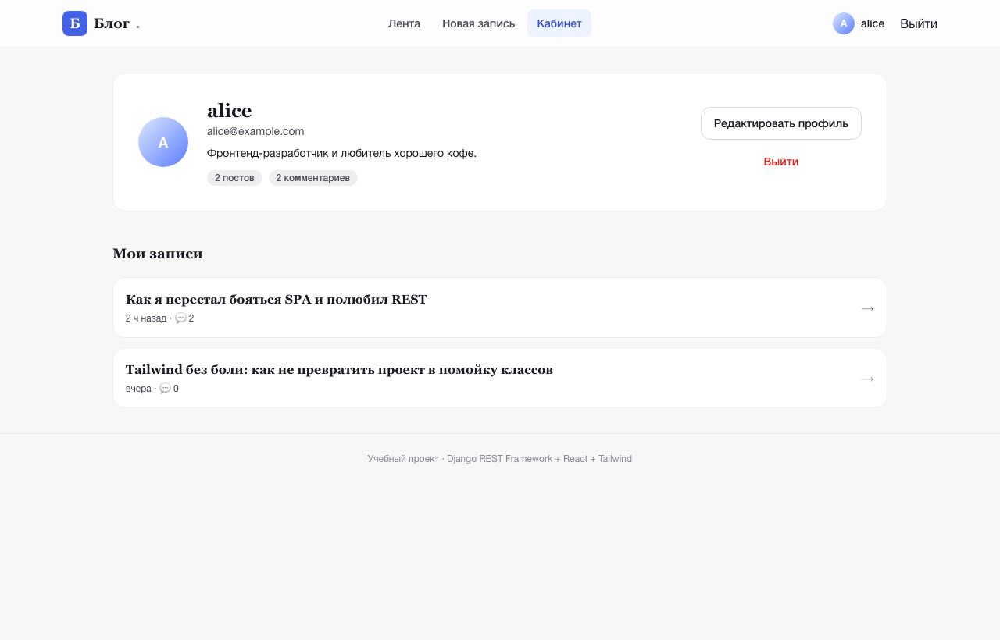

# Blog SPA — Django REST Framework + React + Tailwind

Веб-приложение (SPA) — текстовый блог с комментариями. Полный CRUD для постов и комментариев, авторизация по JWT, личный кабинет с возможностью редактировать профиль и удалять свои записи. Проект реализован как клиент-серверное RESTful-приложение.

- **Backend:** Python 3.12, Django 5.1, Django REST Framework, SimpleJWT, SQLite, Pillow.
- **Frontend:** React 18, React Router 6, Vite 5, Tailwind CSS 3, axios.
- **Авторизация:** JWT (access + refresh), автоматическое обновление токена на клиенте.
- **CRUD:** посты и комментарии; редактировать/удалять может только автор.

---

## 1. Скриншоты рабочего приложения

Ниже — снимки экрана реально работающего приложения (SPA + API). Демо-аккаунты, которые видны на скриншотах, создаются командой `python manage.py seed_demo`:

- `alice@example.com` / `password123`
- `bob@example.com` / `password123`

### 1.1 Страница входа (авторизация)


### 1.2 Регистрация нового пользователя


### 1.3 Лента постов (главная)


### 1.4 Просмотр статьи с комментариями


### 1.5 Создание новой записи


### 1.6 Личный кабинет пользователя


---

## 2. Модели

В базе данных три таблицы: пользователь (`accounts.User`), пост (`blog.Post`) и комментарий (`blog.Comment`). Связи — `ForeignKey` с `CASCADE`: при удалении пользователя удаляются его посты и комментарии, при удалении поста — его комментарии.

```
User ──┬──< Post ──< Comment
       │              │
       └──< Comment ──┘
```

| Приложение | Модель | Поля | Связи |
|---|---|---|---|
| `accounts` | `User` | `username`, `email` (unique, USERNAME_FIELD), `avatar` (ImageField), `bio` (TextField, ≤500), `date_joined`, стандартные от `AbstractUser` (`password`, `first_name`, `last_name`, `is_active`, `is_staff`) | `posts`, `comments` (related_name) |
| `blog` | `Post` | `title` (CharField, ≤200), `slug` (SlugField, unique, автогенерация из title), `body` (TextField), `image` (ImageField, опционально), `created_at`, `updated_at` | `author` → `accounts.User` (CASCADE, `posts`) |
| `blog` | `Comment` | `text` (TextField, ≤1000), `created_at`, `updated_at` | `post` → `Post` (CASCADE, `comments`), `author` → `User` (CASCADE, `comments`) |

Исходники моделей: [`backend/accounts/models.py`](backend/accounts/models.py), [`backend/blog/models.py`](backend/blog/models.py).
Регистрация в Django admin: [`backend/blog/admin.py`](backend/blog/admin.py).

---

## 3. REST API

Базовый префикс: `http://127.0.0.1:8001/api/` (или через Vite-прокси: `http://127.0.0.1:5180/api/`).

| Метод | Эндпоинт | Авторизация | Описание |
|---|---|---|---|
| `POST` | `/api/auth/register/` | — | Регистрация. Возвращает `user`, `access`, `refresh`. |
| `POST` | `/api/auth/login/` | — | Логин по email + пароль. Возвращает `user`, `access`, `refresh`. |
| `POST` | `/api/auth/token/refresh/` | — | Обновление access-токена по refresh. |
| `GET`  | `/api/auth/me/` | Bearer | Профиль текущего пользователя. |
| `PATCH`| `/api/auth/me/` | Bearer | Обновить `username`, `bio`, `avatar` (multipart). |
| `GET`  | `/api/auth/users/<id>/` | — | Публичный профиль пользователя. |
| `GET`  | `/api/posts/` | — | Список постов (пагинация по 10, `?search=`, `?author=`, `?ordering=`). |
| `POST` | `/api/posts/` | Bearer | Создать пост. |
| `GET`  | `/api/posts/<slug>/` | — | Полная статья + список комментариев. |
| `PATCH`| `/api/posts/<slug>/` | Bearer, автор | Редактировать пост. |
| `DELETE`| `/api/posts/<slug>/` | Bearer, автор | Удалить пост. |
| `GET`  | `/api/posts/<slug>/comments/` | — | Комментарии к посту. |
| `POST` | `/api/posts/<slug>/comments/` | Bearer | Добавить комментарий. |
| `GET`  | `/api/comments/<id>/` | — | Получить комментарий. |
| `PATCH`| `/api/comments/<id>/` | Bearer, автор | Изменить комментарий. |
| `DELETE`| `/api/comments/<id>/` | Bearer, автор | Удалить комментарий. |
| `GET`  | `/admin/` | staff | Django admin (модели `User`, `Post`, `Comment`). |

Маршруты: [`backend/config/urls.py`](backend/config/urls.py). Сериализаторы: [`backend/accounts/serializers.py`](backend/accounts/serializers.py), [`backend/blog/serializers.py`](backend/blog/serializers.py). Views: [`backend/accounts/views.py`](backend/accounts/views.py), [`backend/blog/views.py`](backend/blog/views.py).

---

## 4. Маршруты фронтенда

| Путь | Компонент | Защита |
|---|---|---|
| `/` | `Home` | публичный — лента постов с поиском |
| `/login` | `Login` | публичный |
| `/register` | `Register` | публичный |
| `/posts/:slug` | `PostDetail` | публичный — статья + комментарии (комментировать после входа) |
| `/users/:id` | `UserPage` | публичный — профиль автора и его посты |
| `/posts/new` | `PostForm` | `ProtectedRoute` — создание поста |
| `/posts/:slug/edit` | `PostForm` | `ProtectedRoute` + проверка авторства |
| `/profile` | `Profile` | `ProtectedRoute` — личный кабинет |
| `*` | `NotFound` | публичный — 404 |

Исходники: [`frontend/src/App.jsx`](frontend/src/App.jsx), [`frontend/src/components/ProtectedRoute.jsx`](frontend/src/components/ProtectedRoute.jsx).

---

## 5. Установка и запуск (локально)

Требования: Python 3.12+, Node.js 18+.

```bash
# 1) Backend
cd backend
python3.12 -m venv .venv
source .venv/bin/activate
pip install -r requirements.txt
cp .env.example .env
python manage.py migrate
python manage.py seed_demo          # опционально: демо-пользователи и посты
python manage.py runserver 127.0.0.1:8001
```

```bash
# 2) Frontend (в другом терминале)
cd frontend
npm install
npm run dev                          # поднимется на http://127.0.0.1:5180
```

Vite уже настроен с прокси `/api` → `http://127.0.0.1:8001`, поэтому фронт может ходить на бэкенд без CORS-проблем.

Создать суперпользователя для админки: `python manage.py createsuperuser`.

---

## 6. Структура репозитория

```
blog-spa/
├── backend/                  Django + DRF
│   ├── accounts/             кастомный User, JWT-логин/регистрация
│   ├── blog/                 Post, Comment, демо-сид
│   ├── config/               settings, urls, wsgi/asgi
│   ├── manage.py
│   └── requirements.txt
├── frontend/                 React 18 + Vite + Tailwind
│   ├── src/
│   │   ├── api/client.js     axios + авто-рефреш JWT
│   │   ├── context/          AuthContext
│   │   ├── components/       Navbar, ProtectedRoute
│   │   ├── pages/            Home, Login, Register, PostDetail, PostForm, Profile, UserPage, NotFound
│   │   ├── App.jsx
│   │   └── main.jsx
│   ├── tailwind.config.js
│   └── vite.config.js
├── screenshots/              PNG для README
├── scripts/                  утилита рендеринга скриншотов
└── README.md
```

---

## 7. Технические детали

- **JWT-флоу на клиенте:** `src/api/client.js` ставит `Authorization: Bearer <access>`, при `401` пробует обновить по `/auth/token/refresh/`. Если refresh протух — выкидывает на `/login`.
- **Permissions:** `IsAuthorOrReadOnly` в `backend/blog/views.py` — анонимы могут только читать, автор — редактировать/удалять.
- **Slug:** автогенерируется из `title` в `Post.save()`, при коллизии добавляется `-2`, `-3`, …
- **CORS:** `django-cors-headers` разрешает `http://localhost:5173` и `http://127.0.0.1:5180` (через `.env`).
- **MEDIA:** `media/` для аватаров и обложек постов. В dev раздаётся Django.
- **Пагинация:** `PageNumberPagination`, `PAGE_SIZE = 10`.

---

## 8. Дополнительные материалы

- **PDF-отчёт:** [`docs/Blog-SPA-Report.pdf`](docs/Blog-SPA-Report.pdf) — то же содержимое, что в этом README, но в виде 11-страничного PDF со скриншотами (для печати/архива).
- **Скрипт генерации PDF:** [`scripts/build_pdf.py`](scripts/build_pdf.py) — генератор отчёта через `reportlab`.
- **Скрипт генерации скриншотов:** [`scripts/render_screenshots.py`](scripts/render_screenshots.py) — пре-рендер HTML-страниц для headless Chrome.

---

## 9. Лицензия и автор

Учебный проект. Свободное использование.

